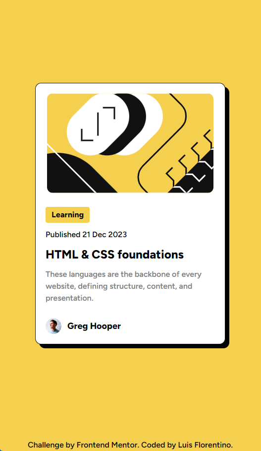
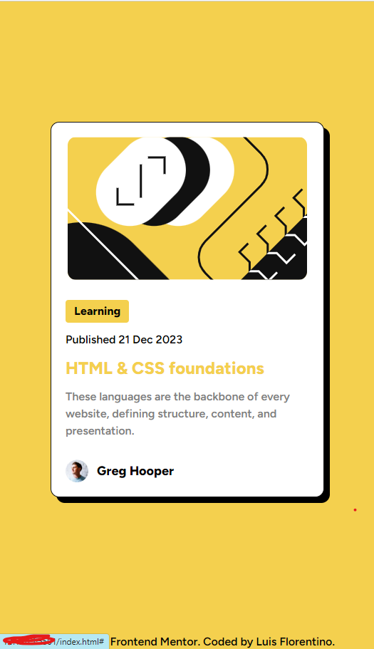

# Frontend Mentor - Blog preview card solution

This is a solution to the [Blog preview card challenge on Frontend Mentor](https://www.frontendmentor.io/challenges/blog-preview-card-ckPaj01IcS). Frontend Mentor challenges help you improve your coding skills by building realistic projects. 

## Table of contents

- [Overview](#overview)
  - [The challenge](#the-challenge)
  - [Screenshot](#screenshot)
  - [Links](#links)
- [My process](#my-process)
  - [Built with](#built-with)
  - [What I learned](#what-i-learned)
- [Author](#author)

## Overview

### The challenge

Users should be able to:

- See hover and focus states for all interactive elements on the page

### Screenshot

### Links

- Solution URL: (https://bright-granita-1c0fcd.netlify.app/)

### Built with

- Semantic HTML5 markup
- CSS custom properties
- Flexbox
- Mobile-first workflow
- [TailwindCss] (https://tailwindcss.com/)

### What I learned

I had to apply the card shadow manually since I was unable to do so through tailwind.

.card-shadow{
    box-shadow: 8px 8px 0px black;
}

I'm was a bit confused about the shorthand box-shadow but playing with the numbers I got the desired results.

## Author

- Frontend Mentor - [@yourusername](https://www.frontendmentor.io/profile/doblel09)
- Twitter - [@DobleL09](https://www.twitter.com/DobleL09)

